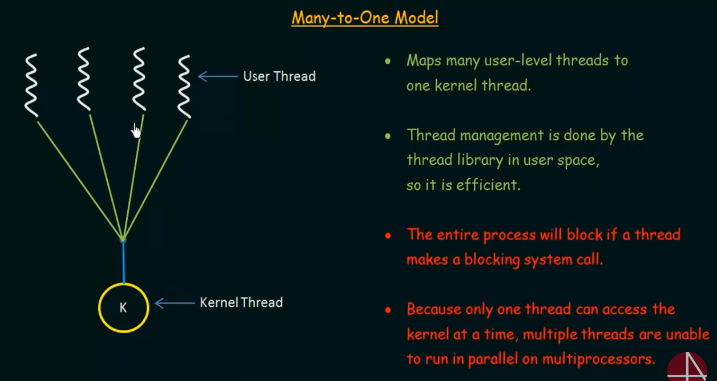

# 42SP - Philosophers

This project was create to teach the basics of threading a process.

## Dining Philosophers Problem

- Several philosophers are sitting at a round table doing one of three things: eating, thinking, or sleeping.
- While eating, they are not thinking or sleeping, while sleeping, they are not eating or thinking and of course, while thinking, they are not eating or sleeping.
- The philosophers sit at a circular table with a large bowl of spaghetti in the center.
- There are some forks on the table.
- As spaghetti is difficult to serve and eat with a single fork, it is assumed that a philosopher must eat with two forks, one for each hand.
- The philosophers must never be starving.
- Every philosopher needs to eat.
- Philosophers don’t speak with each other.
- Philosophers don’t know when another philosopher is about to die.
- Each time a philosopher has finished eating, he will drop his forks and start sleeping.
- When a philosopher is done sleeping, he will start thinking.
- The simulation stops when a philosopher dies.
- Each program should have the same options: number_of_philosophers time_to_die time_to_eat time_to_sleep [number_of_times_each_philosopher_must_eat]
  - number_of_philosophers: is the number of philosophers and also the number of forks
  - time_to_die: is in milliseconds, if a philosopher doesn’t start eating ’time_to_die’ milliseconds after starting his last meal or the beginning of the simulation, it dies
  - time_to_eat: is in milliseconds and is the time it takes for a philosopher to eat. During that time he will need to keep the two forks.
  - time_to_sleep: is in milliseconds and is the time the philosopher will spend sleeping.
  - number_of_times_each_philosopher_must_eat: argument is optional, if all philosophers eat at least ’number_of_times_each_philosopher_must_eat’ the simulation will stop. If not specified, the simulation will stop only at the death of a philosopher.

- Each philosopher should be given a number from 1 to ’number_of_philosophers’.
- Philosopher number 1 is next to philosopher number ’number_of_philosophers’. - Any other philosopher with the number N is seated between philosopher N - 1 and philosopher N + 1
- Any change of status of a philosopher must be written as follows (with X replaced with the philosopher number and timestamp_in_ms the current timestamp in milliseconds)

  - timestamp_in_ms X has taken a fork
  - timestamp_in_ms X is eating
  - timestamp_in_ms X is sleeping
  - timestamp_in_ms X is thinking
  - timestamp_in_ms X died

- The status printed should not be scrambled or intertwined with another philosopher’s status.
- You can’t have more than 10 ms between the death of a philosopher and when it will print its death.
- Again, philosophers should avoid dying!

## What is a Thread?
A thread is an execution context, which is all the information a CPU needs to execute a stream of instructions. A process can contain multiple threads.

## Thread X Process
A program under execution is known as a process and a thread is a basic unit execution. Thread is a basic unit of CPU utilization.

### Threads

Threads Comprises:
- A Thread ID
- A Program counter
- A register set
- A stack

Threads share the same resources that was allocated to the process they are bellong to. For exemple:
- Code section
- Data section
- Open files
- Signals

### Process

- Run independily from others process
  - Have independent memory space
  - When create a process, the parent variables are duplicated for the child process.
  - Changes in variables on the parent process don't afect the variables in the child process.
- File handlers are duplicated.

### Advantages

- Responsiveness > May allow a program to continue running even if part of if is blocked or is performing a lengthy operation, therreby increasing responsiveness to the user.
- Resource Sharing > Allows several different threads to share the same adress space, making the process more economic. Create resources for process it is costly.
- Utilization of Multiprocessor Architecture > Where threads can be running parallel on different processors, making a multithread process run tasks in parallel. A single thread process can run only on one CPU no matter how many CPUs are avaiable.

### Thread execution:

- Read the data in your own register.
- Apply a function required using the data saved in his register.
- Return the result to the data in memory.

## Types of Threads

- User Threads > Supported above the kernel and are managed whitout kernel support.
- Kernel Threads > Supported an manage directly by the operating system.

### Relationship User x Kernel Threads

- Many to One

- One to One
 

- Many to Many > Best solution(most used model)

### Race Condition

A situation where several threads access and manipulate the same data concurrently and the outcome of the execution depends on the particular order in which the access takes place.

[Race Condition(process syncronization)](https://www.youtube.com/watch?v=ph2awKa8r5Y&list=PLBlnK6fEyqRiVhbXDGLXDk_OQAeuVcp2O&index=56)

### Critical Section

Is a section in which the process may be changing commom data, writing commom files and so on.
When one process is executing in its critical section, no other process is to be allowe to execute in its critical section.

[Critical Section](https://www.youtube.com/watch?v=UtEORPakw5Y&list=PLBlnK6fEyqRiVhbXDGLXDk_OQAeuVcp2O&index=58)

### Paralelism

Threads runing simultaniously in different cores. It just can happen if there is a multi core processor.

##Install

### Links

README:

[Tutorial README](https://www.youtube.com/watch?v=eJojC3lSkwg)

Makefile:

[Tutorial Makefile](https://www.youtube.com/watch?v=GExnnTaBELk)

Threads:

[Introdution to Threads](https://www.youtube.com/watch?v=LOfGJcVnvAk&list=PLBlnK6fEyqRiVhbXDGLXDk_OQAeuVcp2O&index=31)

[Multithreading Models](https://www.youtube.com/watch?v=HW2Wcx-ktsc&list=PLBlnK6fEyqRiVhbXDGLXDk_OQAeuVcp2O&index=32)

[Waht is a Thread](https://www.geeksforgeeks.org/thread-in-operating-system/)

[Compiling threads](https://www.youtube.com/watch?v=j9csJohayPU)

[Code Valt - threads](https://www.youtube.com/playlist?list=PLfqABt5AS4FmuQf70psXrsMLEDQXNkLq2)